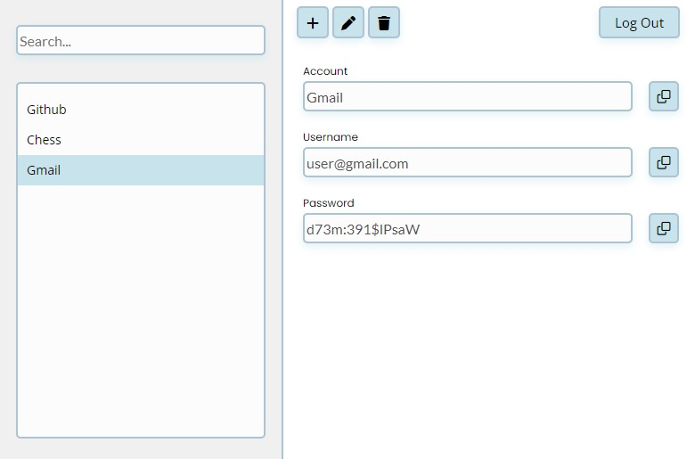

# P4Password

## Description

SImple and secure offline password saver. 😉

## Features

- 👥 Multi-user
- 🔑 Cryptography
- ⚙️ Strong password generator
- 🚀 Auto updating
- 🤯 Idiot proof UI

## Execution

In the terminal go in the project folder and run
    
    npm install

To start the app run

    npm start

## Installation

You can install the app on your operative system also. You just need to run in the terminal
    
    npm run make

This will generate an installer in the `./out` directory.

## How to use

At the beginning the app **has no user**. The first thing you need to do to user the app is **create a user** clicking on the **add user button**. Remember your password because nowadays **there is no way to recover it**.

Wen you have created the user insert your credentials and click login. Now you will see the passwords screen.

Click on the `+` button to start adding your passwords.

## Info

This app was built using the **Electron** framework, the same used to develop apps like **VS Code** and **Whatsapp Desktop**.

It uses a **sqlite** database stored on the device, the **users** table contains the usernames and the **sha 256** of the passwords, there is also the possibility to choose a profile image. The table **passwords** contains the credentials of the users. All credentials are encrypted using **AES-GCM** encrypting algorithm and a **different encryption key** for each user.

I built this app for my personal use but I thought it could be useful for other people who have many passwords to remember but don't want to dave them online, so I decided to upload it on [Github](https://github.com/Maruchero/P4Password).
